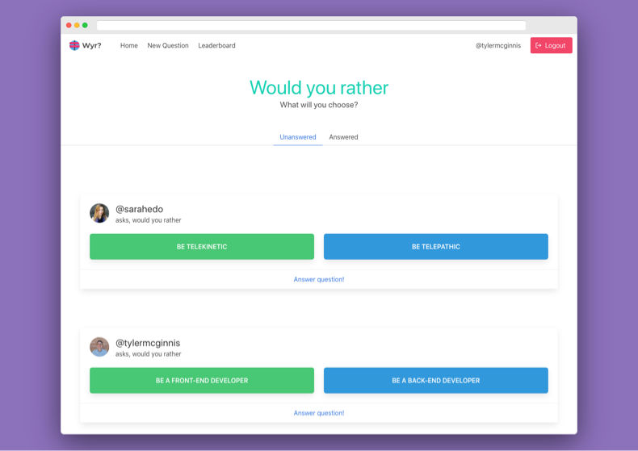
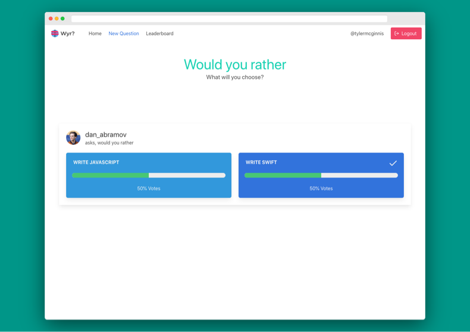
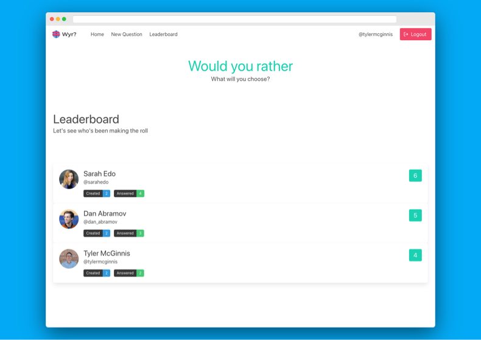

# WouldYouRather Project

[](https://app.netlify.com/sites/gallant-volhard-496c02/deploys)

WouldYouRather is choice based game, that allows users to choose betweent THIS or THAT.

This is Udacity's second React project which implements Redux.

[See the live version here](https://wouldyourather-ak.netlify.app)

## Getting Started

The is single page application based on

- ReactJS (Frontend)
- Redux (State management)
- Bulma (CSS)

### Installing

Clone the repo then use

```
yarn
```

To start the app use

```
yarn start
```

## Screenshots





## Built With

- [React](https://reactjs.org/) - A JavaScript library for building user interfaces
- [Redux](https://redux.js.org/) - A Predictable State Container for JS Apps
- [Bulma](https://bulma.io/) - Open source CSS framework based on Flexbox

## Contributing

Currently not accepting any contributions

## Authors

- **Abhishek Kashyap** - _Initial work_ - [abhishekashyap](https://github.com/abhishekashyap)
